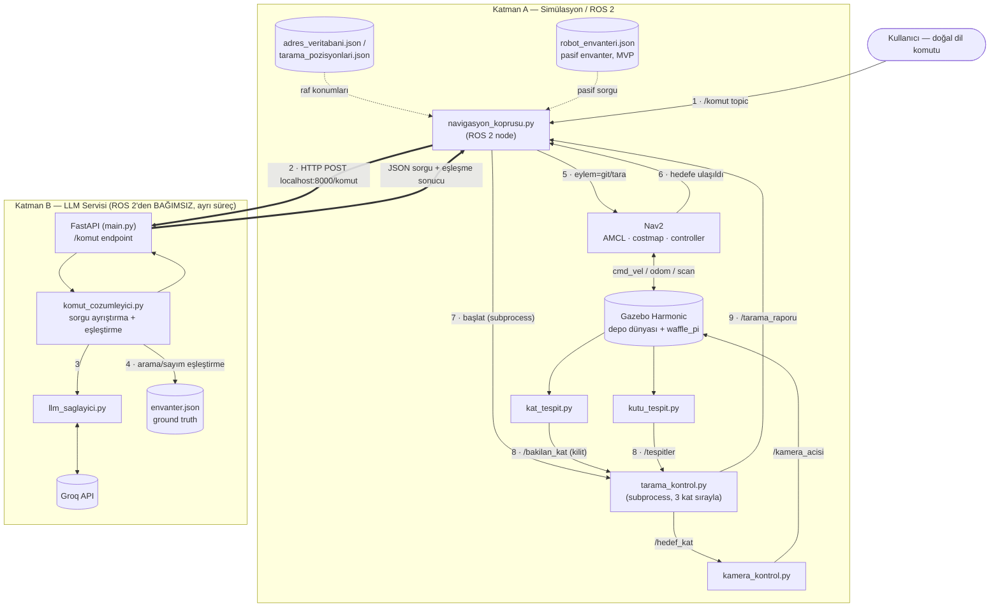

# Yapay Zeka Destekli Akıllı Depo Robotu Simülasyonu

TurtleBot3 Waffle Pi'nin Gazebo Harmonic üzerinde simüle edilmiş 12×12 m'lik bir
depoda dolaşarak doğal dil komutlarıyla verilen görevleri yerine getirdiği bir
sistem: "A1'in 3. katına git" ya da "kırmızı kutuyu bul" gibi bir cümle FastAPI
üzerinden çalışan bir LLM servisine gidiyor, yapılandırılmış bir sorguya
dönüşüyor, Nav2 robotu hedefe götürüyor, kamera rafın önünde dikey tarama
yapıyor ve bulunan kutular renk/boyut/kat bilgisiyle raporlanıp bir envantere
kaydediliyor.

Projeyi özgün kılan dört fikir var: **(a) pasif envanter toplama** — robot bir
hedefe giderken yol boyunca gördüğü *diğer* kutuları da kaydederek zamanla
deponun canlı bir haritasını çıkarıyor; **(b) çok modlu sorgulama** — adres
bazlı, arama, sayım ve (kısmen) tarif bazlı sorgu tiplerini ayrı ayrı
destekliyor, çünkü gerçek bir depoda "kırmızı kutuyu getir" tek başına
anlamsız (onlarca kırmızı kutu olabilir); **(c) aktif algılama** — sabit
kamera dar koridorda rafın üç katını birden göremediği için kameraya bir tilt
ekseni eklendi, robot rafın önünde durup kamerayı dikey tarıyor; **(d) ground
truth ile ölçülebilirlik** — depodaki her kutunun gerçek konumu
`envanter.json`'da kayıtlı olduğu için "çalışıyor" demek yerine precision,
recall, konumlandırma hatası gibi somut sayılar raporlanabiliyor.

**Tasarım ilkesi:** Belirsizliği LLM çözer, kesinliği veritabanı sağlar — LLM'e
koordinat hesaplatılmaz (uydurur), veritabanına da cümle yorumlatılmaz
(yapamaz).

---

## Öne çıkan sonuçlar

Aşağıdaki sayılar Sprint 5/6'da toplanan ham test verilerinden hesaplandı
(bkz. `PROJE_DOSYASI.md` §7). Metodoloji notları önemli — her satırın altında
kısaca belirtildi.

| Karşılaştırma | Sonuç |
|---|---|
| **LLM (Groq, `openai/gpt-oss-120b`) vs anahtar-kelime ayrıştırma** | **%97.1 (67/69)** vs **%88.4 (61/69)** tam eşleşme, 69 elle etiketlenmiş komutluk test setinde (`llm_servis/dogruluk_seti.json`) |
| **Tilt (dinamik) kamera vs sabit kamera — 3. kat doğruluğu** | Tilt: **27/27 (%100)** — Sabit: **0/27 (%0)**. Sabit kamerada 3. kattaki hiçbir kutu görüş alanına girmiyor |
| Tilt vs sabit kamera — genel doğruluk (9 raf, havuzlanmış) | Tilt: **%100 (96/96)** — Sabit: **%69.8 (67/96)** |
| Tilt vs sabit kamera — ort. tarama süresi | Tilt: 24.7 s — Sabit: 44.7 s |
| Tilt vs sabit kamera — konumlandırma hatası (Öklid, ort./std) | Tilt: 0.179 m / 0.048 — Sabit: 0.235 m / 0.288 (2.245 m'lik bir aykırı değer dahil) |
| Tespit **recall** (9 raf, makro / mikro) | %96.7 / %87.7 |
| Tespit **precision** (9 raf, makro / mikro) | %77.8 / %78.2 |
| Oracle vs algı (LIDAR-minimum) mesafe sapması | 9 rafın hepsinde tutarlı **+%3.0–%3.2 (≈4.7–5.2 cm) fazla tahmin** |

Detaylar için: precision/recall tanımı ve payda tasarımı notu için
`PROJE_DOSYASI.md` "Sonuç 1"; tilt/sabit karşılaştırmasının tam metodolojisi
(9 rafın `gz service set_pose` ile teleport edilip gerçek `tarama_kontrol.py`
ile taranması) için "Sonuç 4"; LLM vs anahtar-kelime ayrıştırmanın hata
analizi için "Sonuç 3".

---

## Sistem mimarisi (özet)

Sistem, birbirinden **bağımsız iki süreç** olarak çalışıyor: ROS 2/Gazebo
tarafı (Katman A) ve LLM servisi (Katman B). İkisi arasındaki TEK bağlantı,
`navigasyon_koprusu.py`'nin attığı düz bir HTTP POST — bu bilinçli bir
mimari karar (Sprint 4 "KARAR VERİLDİ": `llm_servis` ROS 2'den bağımsız
kalmalı, kendi `pip install`'ı var, colcon zincirine dahil değil).



Akış sırası: **(1)** kullanıcı komutu `/komut` topic'ine düşer →
**(2)** `navigasyon_koprusu.py` bunu HTTP POST ile `llm_servis`'e yollar
(iki katman arasındaki TEK bağlantı noktası) → **(3)** `llm_servis` Groq
API'yi çağırıp yapılandırılmış JSON sorgu üretir → **(4)** arama/sayım
sorgularında `envanter.json`'a karşı eşleştirilip sonuç üretilir →
**(5)** köprü sonucu alır: `eylem=git` ise sadece Nav2, `eylem=tara` ise
Nav2 + `tarama_kontrol.py` subprocess'i → **(6)** Nav2 robotu hedefe
götürür → **(7)** `tarama_kontrol.py`, 3 katı sırayla `kamera_kontrol.py`'ye
`/hedef_kat` ile bildirir → **(8)** `kat_tespit.py` (kilit onayı) ve
`kutu_tespit.py` (asıl tespit) sonuçlarını üretir → **(9)**
`tarama_kontrol.py` `/tarama_raporu`'nu köprüye döner, log/rapor olarak
kaydedilir.

---

## Kurulum

### Yazılım yığını

| Bileşen | Sürüm |
|---|---|
| İşletim sistemi | Ubuntu 22.04 (Jammy) |
| ROS | ROS 2 Humble Hawksbill |
| Simülatör | Gazebo Sim 8.14.0 (Harmonic) — **Classic 11 değil** |
| Robot | TurtleBot3 waffle_pi (kaynaktan derlendi, `jazzy` branch, Humble için yamalı) |
| Python | 3.10, `setuptools==58.2.0`'a sabitlendi |

> `turtlebot3_simulations` bu workspace'te kaynaktan derlenmiş ve elle
> yamalanmıştır (Y1–Y9). Workspace sıfırdan kurulursa bu yamaların hepsi
> tekrar uygulanmalı — tam liste ve `sed` komutları için `PROJE_DOSYASI.md`
> §5.

### ROS 2 paketi

```bash
staj                         # her yeni terminalde önce bu (TURTLEBOT3_MODEL, GZ_SIM_RESOURCE_PATH ayarlar)
cd ~/staj_ws
colcon build --symlink-install --packages-select depo_robotu
```

### LLM servisi (`llm_servis/`)

Bağımsız bir servis, ayrı kurulur:

```bash
cd ~/staj_ws/src/depo_robotu/llm_servis
pip install -r requirements.txt
cp .env.example .env
```

`.env` içine **`GROQ_API_KEY=...`** ekleyin — production'da kullanılan
sağlayıcı budur (`openai/gpt-oss-120b` modeli). `GOOGLE_API_KEY` (Gemini)
dosyada bilerek bırakıldı ama artık kullanılmıyor; günlük kota limitine
(20 istek/gün, ücretsiz katman) takıldığı için 25 Ağustos 2026'da Groq'a
geçildi.

```bash
uvicorn main:app --reload --port 8000
```

### Çalıştırma

```bash
# Terminal 1 — simülasyon
staj
ros2 launch depo_robotu depo.launch.py

# Terminal 2 — LLM servisi
cd ~/staj_ws/src/depo_robotu/llm_servis && uvicorn main:app --reload --port 8000

# Terminal 3 — navigasyon köprüsü
staj
ros2 run depo_robotu navigasyon_koprusu
```

---

## Kullanım örnekleri

`/komut` uç noktasına (veya `navigasyon_koprusu` üzerinden robota) doğal dil
komutu gönderilir:

```bash
curl -X POST http://localhost:8000/komut \
     -H "Content-Type: application/json" \
     -d '{"metin": "A1in 3. katina git"}'
```
→ `{tip: adres, raf: A1, kat: 3}` olarak çözümlenir, Nav2 robotu A1'in önüne
götürür, kamera 3. katı tarar, bulunan kutular raporlanır.

```bash
curl -X POST http://localhost:8000/komut \
     -H "Content-Type: application/json" \
     -d '{"metin": "kirmizi kutuyu bul"}'
```
→ `tip: arama` sorgusu üretir; envanterde birden fazla kırmızı kutu varsa
`belirsiz: true` ile tam eşleşme listesi döner.

```bash
curl -X POST http://localhost:8000/komut \
     -H "Content-Type: application/json" \
     -d '{"metin": "kac yesil kutu var"}'
```
→ `tip: sayim` sorgusu, sadece eşleşme sayısını döner (kutu listesi
döndürülmez — bilinçli tasarım).

---

## Bilinen sınırlar

Proje bazı önemli noktalarda henüz tamamlanmadı.

- **Nav2 navigasyonu robotun spawn noktası civarında sistematik olarak
  başarısız oluyor (`NOTLAR.md` SORUN 18).** **Kök sebep bulundu:** kayıtlı
  harita (`maps/depo_haritasi.yaml`/`.pgm`) sadece y=-1.21 … 10.94 aralığını
  kapsıyor, ama robotun spawn noktası (`worlds/depo.sdf`) y=-5'te — yani
  spawn noktası haritanın kapsadığı alanın **~3.79 metre dışında** kalıyor.
  Robot spawn olduğu anda zaten costmap'in "görüş alanı" dışında bir noktada
  duruyor, bu yüzden `GridBased: failed to create plan` /
  `Robot is out of bounds of the costmap!` hatası ilk andan itibaren, her
  seferinde tetikleniyor. En olası açıklama: SLAM haritalaması sırasında
  robot spawn/kapı bölgesini (güney duvarındaki giriş) yeterince
  taramamış, `slam_toolbox` o bölgeyi haritaya hiç işlememiş. **Düzeltme
  (haritayı bu bölgeyi kapsayacak şekilde yeniden çıkarmak + 9 rafın
  konumunu yeni haritaya göre yeniden kalibre etmek) zaman kısıtı nedeniyle
  ERTELENDİ.** Bu yüzden Sprint 5 madde 1 ve 4'ün ("zinciri kapat", "hedefe
  varınca görsel doğrulama") **uçtan uca canlı Nav2 doğrulaması hâlâ
  yapılamadı** — kod hazır ve izole testlerle doğrulandı ama gerçek
  navigasyon başarısı gerektiren son adım eksik. Aynı sebeple Sprint 6'nın
  "görev başarı oranı" metriği de ölçülemiyor.

- **Tespit precision'ını etkileyen iki ayrı sızıntı/belirsizlik kaynağı
  var** (`NOTLAR.md` SORUN 12 / SORUN 17): `kutu_tespit.py`'nin geniş FOV'u,
  hedeflenen raftan geometrik olarak imkânsız olsa da komşu rafların (örn.
  B2 taranırken A2/C2) kutularını da görüş alanına alabiliyor
  ("kapsam dışı" tespitler — bu artık ayrı bir alanda raporlanıyor ama
  kaynağı çözülmedi). Ayrıca raf içi ama yanlış eşleşen ("fazla") tespitler
  sistematik olarak 1. katta yoğunlaşıyor — bunun sebebi kat tespitinin
  dayandığı `x=mesafe` düzlem varsayımının derinlik belirsizliği (rafların
  arkası açık olduğu için kamera bazen aynı x-sütunundaki daha uzak bir
  rafı görebiliyor). Her iki durum da kod değişikliğiyle çözülmedi, sadece
  ayrı hata modları olarak kaydedildi.

- **Pasif envanter toplama şu an MVP seviyesinde:** robot yol boyunca
  gördüğü her şeyi biriktirmiyor, sadece açıkça "tara" komutu verilen
  raflardan topluyor. "Robot bir hedefe giderken yolda gördüğü *diğer*
  nesneleri de kaydeder" fikri (§1.3a) henüz tam anlamıyla pasif değil.

- **Groq'a geçiş sonrası bazı uçtan uca davranışlar henüz yeniden
  doğrulanmadı.** 69 komutluk doğruluk ölçümü (%97.1) *sadece* sorgu
  ayrıştırmayı (metin → JSON) test ediyor. Sprint 5'in canlı Nav2
  entegrasyon testleri (eylem ayrımı git/tara, "en yakını bul", çoklu-eşleşme
  seçimi "ilkini/ikincisini seç", iptal/dur komutu) hepsi eski sağlayıcı
  Gemini ile yapılmıştı; Groq ile bu davranışların hiçbiri henüz canlı
  olarak yeniden test edilmedi.

---

## Proje yapısı

```
depo_robotu/
├── worlds/depo.sdf                  ← depo dünyası (9 raf, 3×3 ızgara)
├── launch/depo.launch.py            ← ana launch dosyası
├── config/nav2_params_depo.yaml     ← Nav2 parametreleri (RPP controller)
├── maps/                            ← SLAM ile çıkarılmış harita
├── araclar/
│   ├── kutu_uret.py                 ← kutu üretme betiği
│   ├── envanter.json                ← GROUND TRUTH
│   └── ...analiz/test betikleri (Sprint 5/6 ölçümleri)
├── depo_robotu/                     ← ROS 2 Python node'ları
│   ├── kamera_kontrol.py            ← LIDAR mesafesi → tilt açısı
│   ├── kat_tespit.py                ← TF'ten kamera yönü → ışın-düzlem kesişimi
│   ├── kutu_tespit.py               ← HSV renk tespiti + kat/boyut tahmini
│   ├── tarama_kontrol.py            ← Look-and-Move orkestrasyonu
│   └── navigasyon_koprusu.py        ← LLM servisi ↔ Nav2 köprüsü
├── llm_servis/                      ← bağımsız FastAPI servisi
│   ├── main.py
│   ├── komut_cozumleyici.py
│   ├── llm_saglayici.py             ← sağlayıcı çağrısı tek fonksiyonda (llm_cagir)
│   ├── sorgu_semasi.py
│   └── dogruluk_seti.json           ← 69 komutluk etiketli test seti
├── NOTLAR.md                        ← sorunlar/çözümler günlüğü
└── PROJE_DOSYASI.md                 ← tam devir belgesi (bu README'nin kaynağı)
```

---

Detaylı teknik kararlar, yamalar, ölçüm metodolojileri ve açık konuların tam
listesi için `PROJE_DOSYASI.md`'ye bakın.
